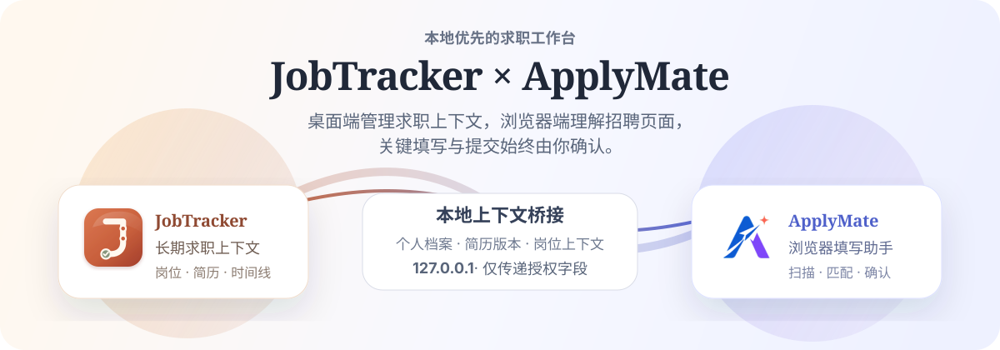
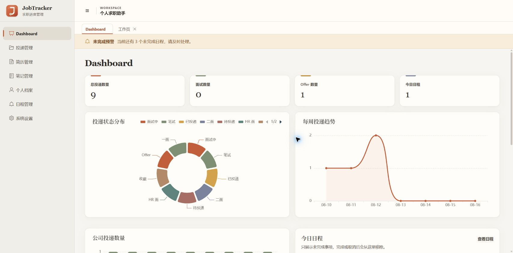
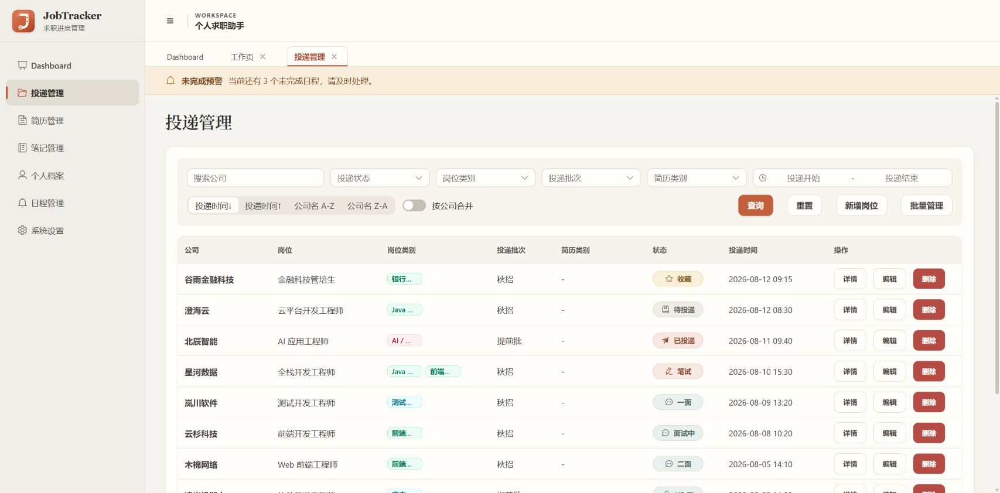
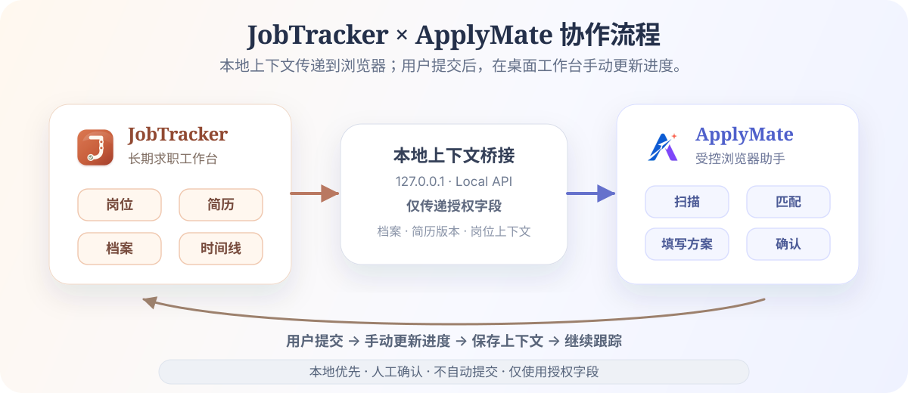
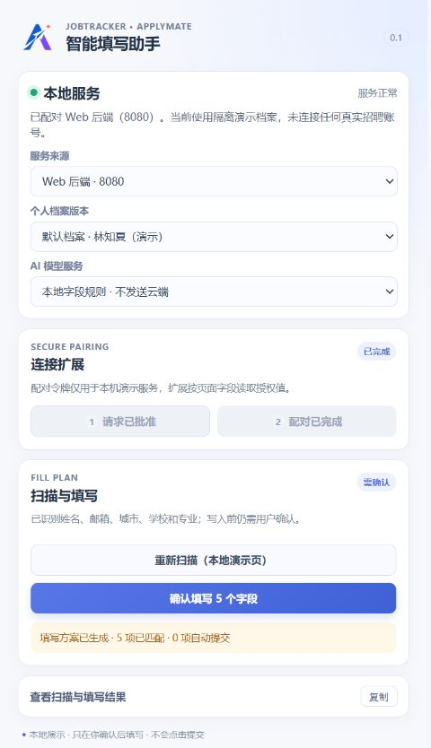
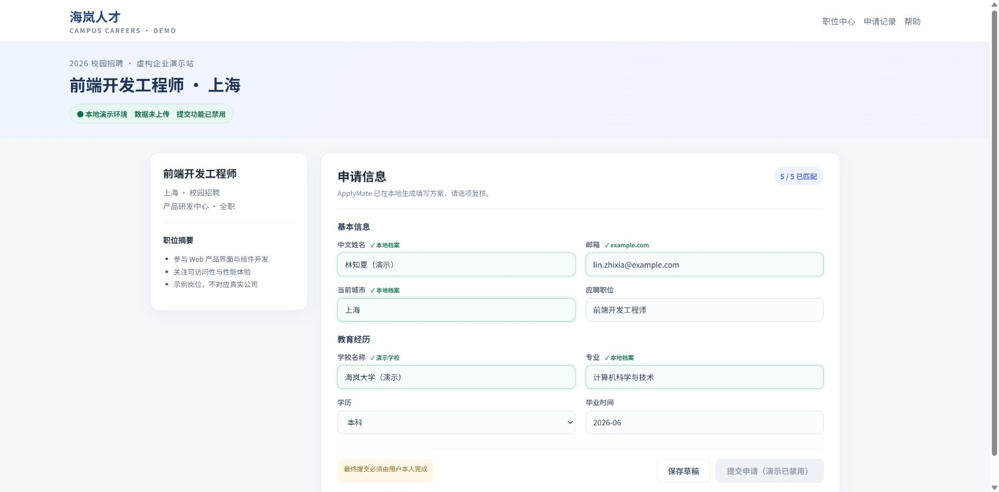
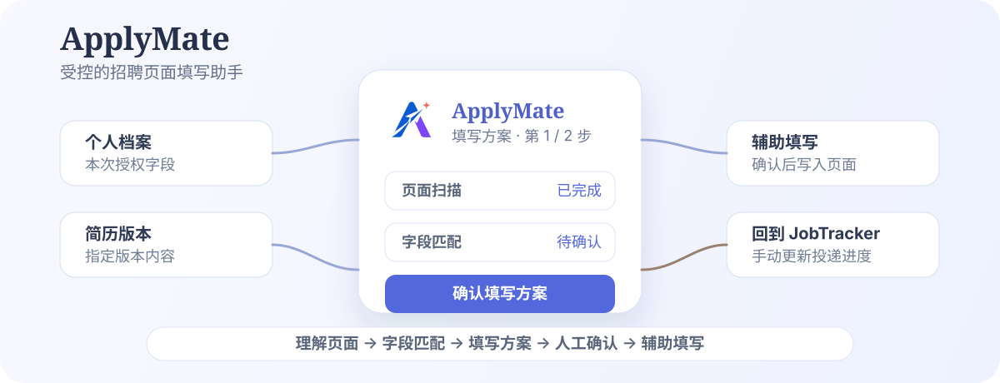
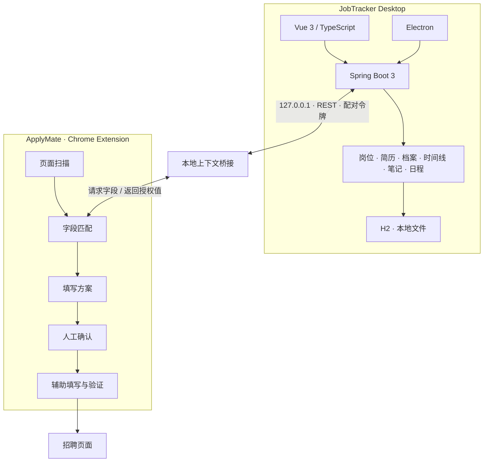

<p align="center">
  
</p>

<p align="center">
  <strong>JobTracker 1.3.0 · ApplyMate 0.1.0 Alpha · 本地优先 · 人工确认</strong><br>
  Windows 10 / 11 · Vue 3 · TypeScript · Electron · Spring Boot 3 · H2 · Chrome Extension
</p>

<p align="center">
  <a href="#协作方式">协作方式</a> ·
  <a href="#jobtracker-desktop">JobTracker Desktop</a> ·
  <a href="#applymate">ApplyMate</a> ·
  <a href="#本地优先与安全边界">安全边界</a> ·
  <a href="#快速开始">快速开始</a>
</p>

JobTracker Desktop 是长期管理求职上下文的本地桌面工作台，ApplyMate 是浏览器侧的招聘页面理解与辅助填写工具。

两者通过本地接口共享经过配对授权的档案版本和岗位上下文，完成页面扫描、字段匹配、填写方案生成与人工确认。**ApplyMate 不会自动提交申请；最终检查与提交始终由用户本人完成。**

> 核心原则：**本地优先 · 人工确认 · 不自动提交 · 仅使用授权字段**

## 项目介绍

一次投递往往散落在招聘网站、Excel、本地简历、Markdown、浏览器收藏、日历和面试记录中。填写新申请时，又要重复查简历、复制个人信息、确认项目经历、记录投递并更新进度。

JobTracker Desktop + ApplyMate 把两类信息连接起来：

```text
长期求职上下文 + 当前招聘页面
```

桌面端保存可以长期复用的岗位、简历、档案与时间线；浏览器端只处理眼前页面，并把真正的填写和提交决定留给用户。

## 真实界面

<p align="center">
  
</p>

Dashboard 汇总投递数量、面试与 Offer、状态分布、每周趋势、公司统计和今日日程。项目已提供岗位、岗位详情、简历、笔记、日程与设置等真实界面，不以概念图代替产品实现。

> 截图由本地隔离 H2 演示库生成；姓名、学校、公司、岗位与邮箱均为虚构或保留域示例，没有连接真实招聘账号，也没有提交任何申请。

<details>
<summary><strong>查看更多真实界面</strong></summary>

### 岗位管理

<p align="center">
  
</p>

### 岗位详情与招聘流程

<p align="center">
  
</p>

### 简历版本

<p align="center">
  
</p>

### 笔记与日程

<p align="center">
  
  
</p>

> 截图来自当前版本的隔离演示环境；姓名、学校、公司、岗位和目录均为虚构或通用示例。

</details>

## 产品组成

| 能力 | JobTracker Desktop | ApplyMate |
| --- | :---: | :---: |
| 岗位与投递状态 | ✅ | 读取当前岗位上下文 |
| 简历版本 | ✅ | 通过关联档案读取字段 |
| 个人档案与历史快照 | ✅ | 读取所选版本的请求字段 |
| 面试记录、时间线、日程 | ✅ | — |
| 页面扫描与字段识别 | — | ✅ |
| 本地规则 / 可选 AI 映射 | — | ✅ |
| 填写方案 | — | ✅ |
| 辅助填写与写入验证 | — | ✅ |
| 自动提交 | ❌ | ❌ |

> JobTracker Desktop 管理长期上下文，ApplyMate 理解当前招聘页面，最终决定始终由用户完成。

## 协作方式

<p align="center">
  
</p>

扩展先创建配对请求，用户在桌面端批准后领取访问令牌。扫描时，ApplyMate 根据页面中实际识别到的字段 key，向本地服务请求对应档案值，而不是复制一份完整档案到扩展中。

当前版本尚未自动同步投递结果：用户在招聘页面提交后，需要回到 JobTracker Desktop 手动更新状态与下一步。

## JobTracker Desktop

JobTracker Desktop 是长期求职工作台，目前包含以下模块：

- **岗位与投递**：保存 JD、链接、状态、招聘节点、备注和下一步。
- **简历版本**：上传、预览、下载和分类管理 PDF / Word 简历，查看每份简历关联的岗位。
- **个人档案**：维护多个档案版本、解析草稿与历史快照，并处理 ApplyMate 配对请求。
- **面试与时间线**：为招聘流程节点记录结果、时间、面试信息和复盘。
- **日程与提醒**：使用月、周、日与列表视图安排面试、截止日和待办。
- **数据看板**：查看投递状态、趋势、公司分布和今日日程。
- **资料与 Markdown 笔记**：管理目录、文本资料和常见文档预览。

### 简历版本与投递关联

每条投递可以绑定当时使用的简历版本。后续进入面试或复盘时，可以重新确认企业收到的是哪一版简历，而不是依赖文件名或记忆猜测。

## ApplyMate

<p align="center">
  
  
</p>

上图使用同一套本地演示档案展示扩展状态与招聘表单结果：5 个字段完成匹配，云端模型关闭，最终提交按钮禁用。截图不包含真实个人信息，也没有连接或操作任何真实招聘网站。

<p align="center">
  
</p>

ApplyMate 目前是基于 WXT / Chrome Manifest V3 的开发期扩展。它使用通用 DOM 扫描与字段注册表处理常见表单控件，并可在已配置模型时为低置信度字段补充 AI 映射。

### 1. 页面扫描

识别当前页面中可见且可编辑的 `input`、`textarea` 和 `select`，收集标签、必填状态、候选项与上下文。文件、密码、隐藏字段、复选框和单选框目前不会进入填写流程。

### 2. 字段匹配

优先使用本地字段注册表匹配页面字段；当用户配置了可用的 LLM Provider 时，也可以请求后端执行字段语义映射。扩展随后只按识别出的字段 key 读取所选档案版本。

### 3. 生成填写方案

ApplyMate 不会在扫描后直接修改页面，而是先生成填写方案并显示字段、候选值、来源和需要复核的结果。

| 招聘字段 | 候选值 | 来源 | 状态 |
| --- | --- | --- | --- |
| 姓名 | 示例姓名 | 个人档案 | 已匹配 |
| 学校 | 示例大学 | 档案版本 | 已匹配 |
| 项目经历 | 示例项目 | 档案版本 | 待确认 |
| 期望薪资 | — | — | 需要手动填写 |

> 表格用于解释 Fill Plan 的信息结构，实际扩展当前以可展开的扫描 / 填写结果展示计划。

### 4. 用户确认并辅助填写

用户确认后，ApplyMate 才会把计划写入页面并回读验证。网页重渲染、候选项不匹配或实际值不同都会返回明确结果；扩展不会假装填写成功，也不会点击最终提交按钮。

## 完整投递流程

1. 在 JobTracker Desktop 中创建或选择岗位。
2. 选择本次投递使用的简历，并关联对应档案版本。
3. 打开企业招聘页面。
4. ApplyMate 扫描页面中的常见表单控件。
5. 使用本地规则与可选 AI 匹配字段。
6. 从本地服务读取本次需要的档案字段并生成填写方案。
7. 用户检查并确认填写方案。
8. ApplyMate 辅助写入页面并验证结果。
9. **用户本人检查页面并提交申请。**
10. 回到 JobTracker Desktop，手动更新投递进度和下一步。

## 本地优先与安全边界

```text
JobTracker Desktop
        │
        │ 127.0.0.1 / REST / 配对令牌
        ▼
    ApplyMate
        │
        │ 仅在用户主动操作后扫描与填写
        ▼
 Recruitment Page
```

桌面打包配置只监听 `127.0.0.1`。档案、简历、岗位、日程和授权状态默认保存在本地 H2 数据库与本地文件中；ApplyMate 使用经桌面端批准、可撤销的配对令牌访问字段接口。

| 数据 / 操作 | 默认位置 | ApplyMate 当前边界 |
| --- | --- | --- |
| 个人档案 | 本地 H2 | 配对后按请求字段读取；身份类字段被后端过滤 |
| 简历文件 | 本地文件 | 不读取文件；通过档案版本使用已确认信息 |
| 岗位上下文 | 本地 H2 | 可按当前招聘页面 URL 选择投递关联的档案版本 |
| 面试笔记、普通笔记、日程 | 本地 | 不读取 |
| 密码、验证码 | 不应保存 | 不扫描、不读取、不填写 |
| 文件上传、同意项 | 招聘页面 | 当前不处理 |
| 最终提交 | 招聘页面 | 不执行 |

### 可选云端 AI

项目的核心岗位管理、档案存储和基于本地规则的字段匹配不依赖云端服务。若用户主动配置并启用 Qwen、DeepSeek 等远程 LLM Provider，简历文本解析或低置信度字段映射会把完成任务所需的内容发送给相应服务商；API Key 由本机环境变量提供，不返回浏览器扩展，也不写入档案快照。

### 当前限制

- 后端已使用配对 token 保护档案字段接口，但当前 CORS 仍允许 `chrome-extension://*`；合同中规划的请求 Origin 与固定 Extension ID 校验尚未完全落地。
- ApplyMate 当前使用通用表单扫描器，没有维护招聘网站专用 Adapter 或正式兼容清单。
- 当前不支持文件、复选框、单选框、验证码、密码和最终提交。
- 投递结果自动回流尚未实现，需要用户手动更新 JobTracker Desktop。

## 系统架构



## 技术栈

| 层级 | 技术 |
| --- | --- |
| Desktop UI | Vue 3 · TypeScript · Vite · Element Plus · ECharts |
| Desktop Runtime | Electron 31 · electron-builder · NSIS |
| Backend | Java 17 · Spring Boot 3.3 · MyBatis Plus |
| Persistence | H2（桌面模式）· MySQL（默认开发 profile）· Local Files |
| Browser Extension | WXT · Chrome Extension · Manifest V3 |
| Communication | REST · `127.0.0.1` · Bearer pairing token |
| Document Processing | Apache Tika · Apache POI |
| Optional AI | OpenAI-compatible API · Qwen · DeepSeek · local provider |
| Build / Release | PowerShell · GitHub Actions |

## 快速开始

### 普通用户

当前仓库处于 Alpha 阶段，未在 README 中提供已核验的稳定 Release 下载入口。Windows 安装包可以从源码构建；ApplyMate 仍需通过 Chrome / Edge 开发者模式加载。

1. 构建并安装 JobTracker Desktop。
2. 构建 ApplyMate 扩展。
3. 在 `chrome://extensions` 或 `edge://extensions` 启用“开发者模式”。
4. 解压 GitHub Actions 生成的 `ApplyMate-<version>-chrome-mv3.zip`，选择“加载已解压的扩展程序”；源码构建时则加载 `extension/.output/chrome-mv3`。
5. 打开扩展创建配对请求，并在 JobTracker Desktop 的“个人档案”页批准。
6. 返回扩展完成配对，选择档案版本，再在招聘页面发起扫描。

### 开发者

#### 环境要求

- Windows 10 / 11
- JDK 17
- Maven 3.9+
- Node.js 22 与 npm
- Chrome 或 Edge

#### 启动桌面 Web 栈

后端使用 `desktop` profile 和 H2；把端口设为 `8080`，与当前 Vite 代理配置保持一致：

```powershell
cd backend
mvn spring-boot:run "-Dspring-boot.run.profiles=desktop" "-Dspring-boot.run.arguments=--server.port=8080"
```

另开终端启动前端：

```powershell
cd frontend
npm install
npm run dev
```

前端默认位于 `http://localhost:5173`，API 由 Vite 代理到 `http://localhost:8080`。

#### 构建并加载 ApplyMate

```powershell
cd extension
npm install
npm run build
```

然后在浏览器扩展管理页加载 `extension/.output/chrome-mv3`。开发期扩展可在弹窗中选择 Web 后端 `8080` 或桌面端服务 `18080`。

#### 构建 Windows 安装包

```powershell
cd desktop
npm install
npm run dist:lite
npm run dist:full
```

| 构建 | 适合场景 | Java Runtime |
| --- | --- | --- |
| Lite | 已安装 Java 17，希望安装包更小 | 不附带 |
| Full | 希望安装后直接使用 | 附带裁剪后的运行时 |

完整构建会先构建 Vue、复制静态资源、打包 Spring Boot JAR，再由 Electron 生成 NSIS 安装包。GitHub Actions 当前也只构建 Windows Lite / Full 安装产物。

## 开发指南

```powershell
# 前端生产构建
cd frontend
npm run build

# 后端测试
cd backend
mvn test

# 扩展生产构建
cd extension
npm run build

# 契约校验
cd contracts
npm test
```

开发 ApplyMate 时，请先阅读 [本地 API 契约](./contracts/LOCAL_API_CONTRACT.md) 和 [ApplyMate 实施说明](./docs/APPLYMATE_IMPLEMENTATION_PLAN.md)。跨端字段 key 以 `contracts/field-registry.json` 为准。

## 项目结构

```text
JobTrackerDesktop/
├── frontend/            Vue 3 桌面界面
├── backend/             Spring Boot、本地 API、H2 / MySQL 与文件访问
├── desktop/             Electron 外壳和 Windows 打包脚本
├── extension/           ApplyMate WXT / Manifest V3 扩展
├── contracts/           Candidate Profile、字段注册表与本地 API 契约
├── database/            数据库基线与迁移脚本
├── assets/readme/       README SVG 与真实产品截图
├── docs/                ApplyMate 设计与实施说明
├── scripts/             本地配置辅助脚本
└── .github/workflows/   Windows 安装包构建
```

## 项目状态

| 模块 | 当前状态 |
| --- | --- |
| JobTracker Desktop | 可用，持续迭代 |
| Candidate Profile / 历史快照 | 已接入，持续完善 |
| 本地上下文桥接 / 配对 | 已接入，安全加固中 |
| ApplyMate 页面扫描与 Fill Plan | Alpha，通用表单能力 |
| 招聘网站专用 Adapter | 尚未建立正式兼容清单 |
| 投递结果自动回流 | 尚未实现 |

## Roadmap

- [x] 岗位与投递管理
- [x] 简历版本与岗位关联
- [x] 面试、日程、提醒和 Markdown 笔记
- [x] 多版本个人档案与历史快照
- [x] `127.0.0.1` 本地接口与可撤销配对 token
- [x] 通用页面扫描、字段注册表和填写方案
- [x] 人工确认后填写与结果回读
- [ ] 收紧 CORS，并校验请求 Origin 与固定 Extension ID
- [ ] 文件、复选框、单选框等更多表单控件的受控处理
- [ ] 建立招聘网站 Adapter 与可复现兼容性测试
- [ ] 更完善的字段映射与 Fill Plan 可视化编辑
- [ ] 用户提交后的投递结果回流
- [ ] 表单兼容性诊断与失败报告

## FAQ

### ApplyMate 会自动投递吗？

不会。ApplyMate 负责页面扫描、字段匹配、填写方案和确认后的辅助填写；最终申请由用户本人检查并提交。

### 我的简历和个人信息会上传到服务器吗？

默认数据保存在本机，ApplyMate 通过 `127.0.0.1` 读取本次需要的档案字段。若你主动启用远程 LLM Provider，相关解析或字段映射任务所需内容会发送给所选服务商；请根据其隐私条款自行判断是否启用。

### ApplyMate 能访问 JobTracker Desktop 的所有数据吗？

不能直接读取完整数据库或本地文件。扩展需要先完成桌面端配对，并通过字段接口按 key 请求值；身份类字段、密码以及未提供接口的数据不会返回。不过当前 Origin / Extension ID 的进一步校验仍在 Roadmap 中。

### 支持哪些招聘网站？

当前没有正式的网站白名单或兼容性承诺。ApplyMate 使用通用扫描器处理常见 HTML 表单，效果取决于目标网站的控件实现；复杂自定义组件可能需要人工填写或后续 Adapter 支持。

### 支持 macOS / Linux 吗？

当前打包脚本、Electron Builder 配置和 GitHub Actions 只生成 Windows NSIS 安装包，README 不宣称 macOS / Linux 支持。Chrome / Edge 扩展处于开发期加载模式。

### 数据如何备份？

打包版把 H2 数据库和默认文件目录放在 Electron 的用户数据目录。除数据库外，还应备份简历、面试笔记、普通笔记与 `storage.properties`；如果在设置中更换过目录，也要一并备份新位置。详细步骤见[最终用户使用说明](./END_USER_MANUAL.md)。

## License

[MIT License](./LICENSE)
